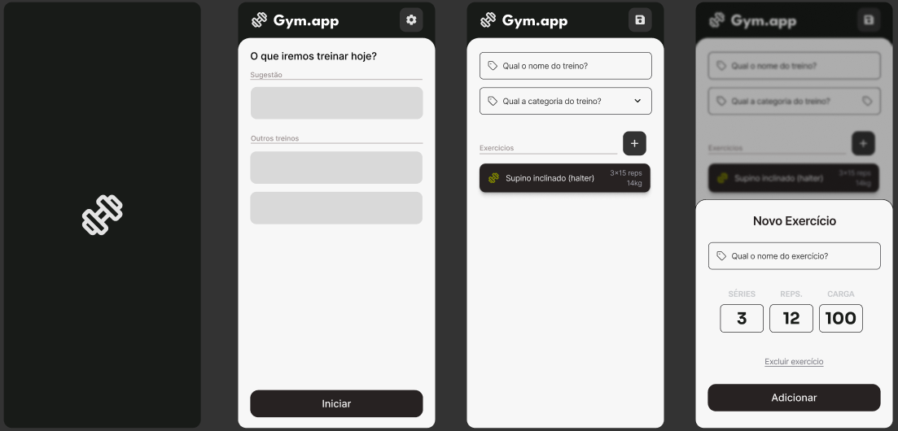

# Mimigym

> Aplicativo Android Kotlin para cadastros e acompanhamento de exercícios.

### Ajustes e melhorias

O projeto ainda está em desenvolvimento e as próximas atualizações serão voltadas para as seguintes tarefas:

- [ ] Construção do fluxo de cadastros de exercícios
- [ ] Construção do fluxo de treino com temporizador
- [ ] Adicionar inteligência de recomendações e insights sobre treino
